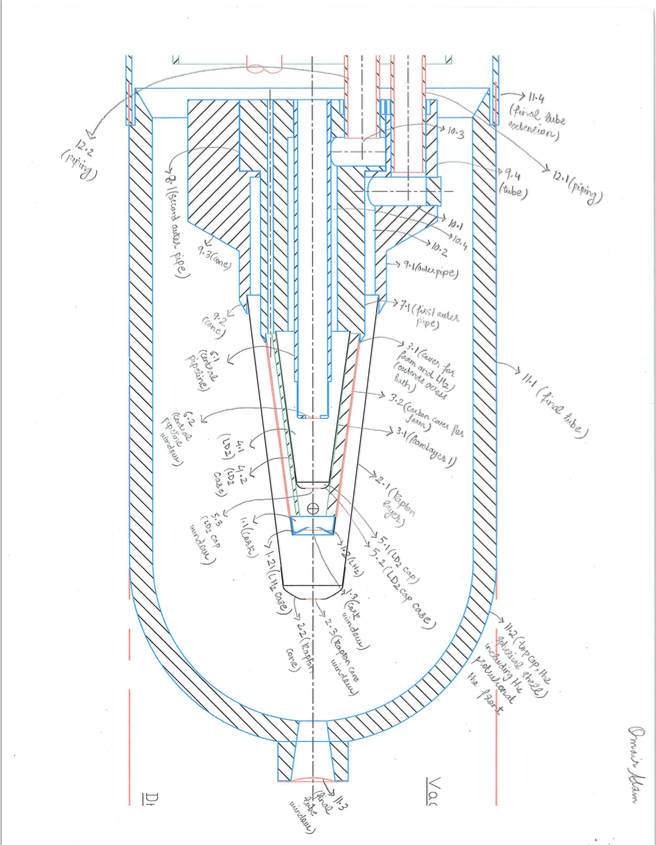

# JLabSummer2015
The work being done in the Software Collaboration

<h3> Target Design </h3>

 This package includes the perl script that has been written to make the geometry for the target to be used in CLAS12. 
  The most recent iteration of the target is: <b>targetRev1.pl</b> 

In order to run the perl script and see the target on GEMC the following steps need to be followed,
  <ol>
    <li> Run <pre>./targetRev1.pl config.dat </pre> in the directory where you are. This produces a text file which contains the geometry. This text file needs to be run in conjunction with gemc at run-time.</li>
    <li> Run <pre> gemc example.gcard </pre> which looks for the text file made above and uses it and the initial conditions provided in the gcard file to make the shape </li>
  </ol>

<figure>
  
  <figcaption>Fig1. - Labelled target schematic.</figcaption>
</figure>
